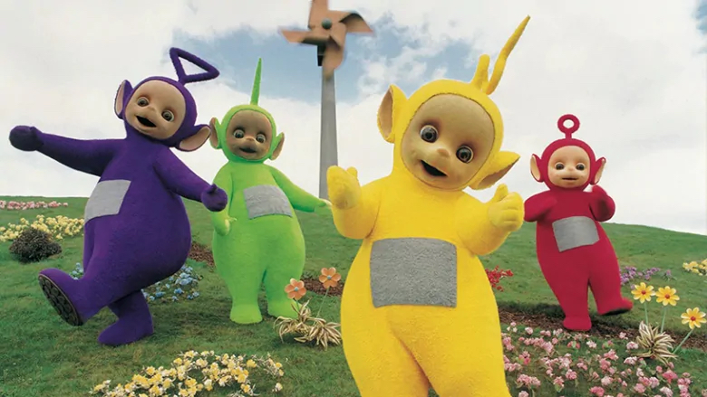

# K-means-clustering-on-an-image
A simple K-means clustering on an image based on colour and pixel position.

Original Image  

Clustering based only off colour  

Clustering based on colour and position  

